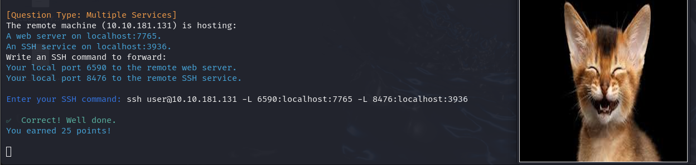
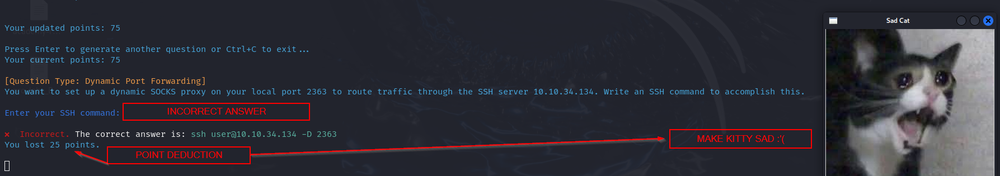

## Intro
My intention with this was to provide an avenue for game-ified learning for Port Forwarding/Tunneling/Pivoting.
I've looked at this so long my eyes have bled. If I'm wrong, PLEASE correct me. I don't want to be putting
out false information; additionally, I would need to reevaluate my understanding if I am. No harm in that.

## Rules
1. Don't make Kitty sad.

I mean it...Don't do it.

2. Use SSH command.
```
ssh user@TARGET IP
```

3. All answers will contain 'user' as the simulated person. Just write user.
```
ssh user@TARGET IP
```

4. Include the correct SSH flags to be valid.

So, if the question specifies a Dynamic Port Forwarding scenario, you must include -D.
```
ssh user@TARGET IP -D PORT
```

5. Read the Question.

You will be given the target IP and ports needed to answer the question (unless I missed something because I'm tired).

6. Proof-Read Your Answer.

It can't take into account spelling errors and such. Just keep that in mind.

## Correct Answer Example


## Wrong Answer Example

